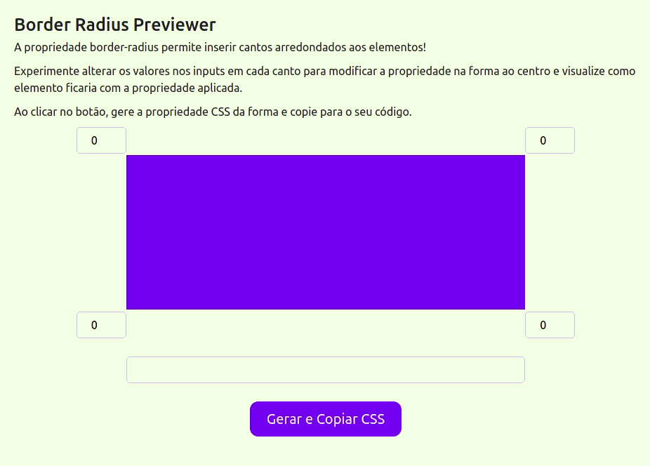

# Border-radius Previewer

**Nível:** 1-Iniciante

A propriedade border-radius pode ter vários valores alterados. Visualize como a forma aparece ao alterar esses valores.

## Histórias de usuário

-   [X] O usuário pode ver um box que tem uma propriedade `border-radius` aplicada a ela
-   [X] O usuário pode alterar os 4 valores `border-radius` que são aplicados à caixa (top-left, top-right, bottom-left, bottom-right)
-   [X] O usuário pode copiar o CSS resultante para a área de transferência

## Recursos bônus

-   [ ] O usuário pode alterar todos os 8 valores possíveis do border-radius, a fim de criar uma forma complexa

## Desenvolvimento

A primeira versão da aplicação foi desenvolvida com HTML, CSS e JS (verificar branch v1) e com o intuito de praticar novos conhecimentos, desenvolvi a segunda versão com as seguintes ferramentas:
- React
- Redux
- Prettier
- ES Lint

## My app

### [border-radius previewer](https://lucasmartins96.github.io/border-radius-previewer/)

#### [retornar ao my-app-ideas](https://github.com/lucasmartins96/my-app-ideas/tree/main/beginner)

<!-- ## Example projects

-   [9elements Fancy Border Radius](https://9elements.github.io/fancy-border-radius/)
-   [Border Radius](https://border-radius.com/)
-   [CSS Gradient Border](https://codepen.io/thebabydino/pen/zbqPVd)
 -->